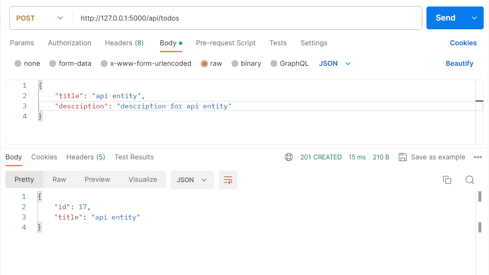
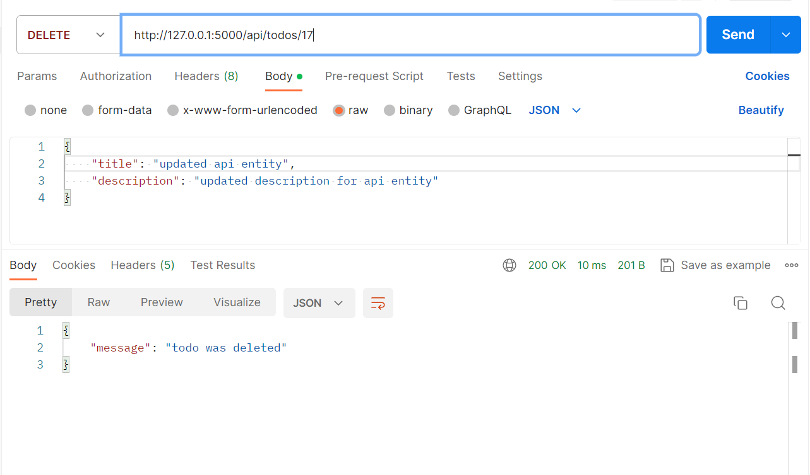
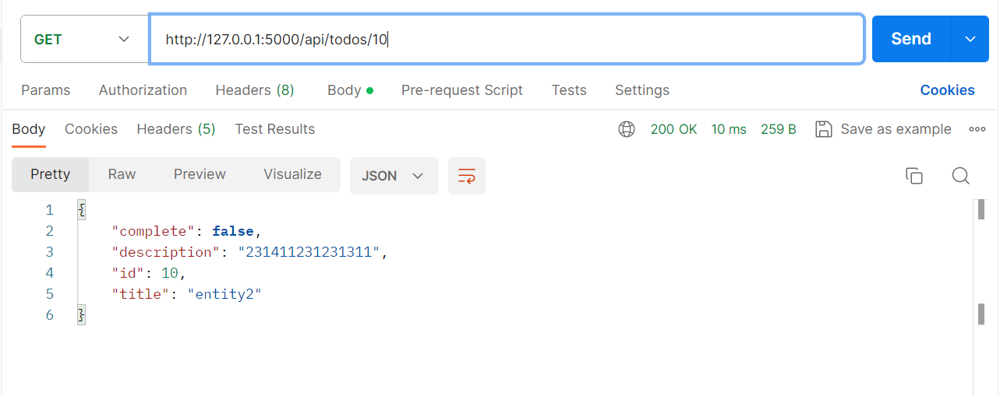
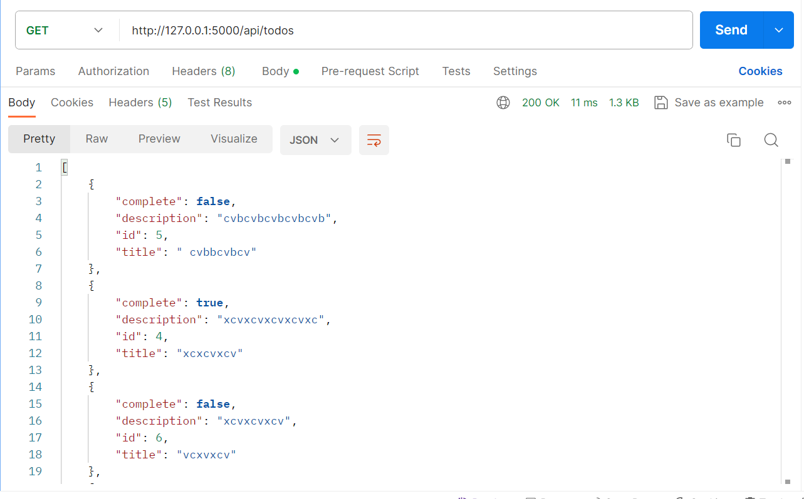
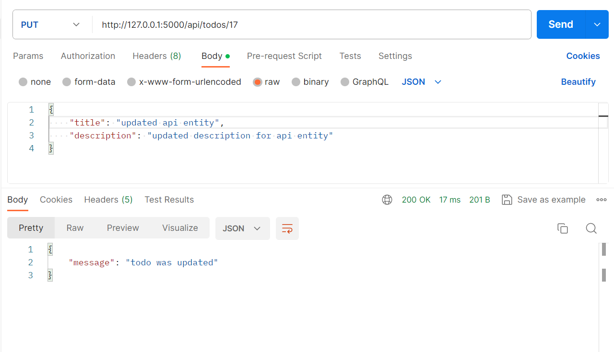

# Project Name

## Description

Lab 13 (API for CRUD Todo )

## Screenshots

Here are screenshots demonstrating various functionalities:

### Screenshot 1: Create a New Todo (POST /todos)

### Screenshot 2: Delete a Todo (DELETE /todos/{id})

### Screenshot 3: Get a Todo by ID (GET /todos/{id})

### Screenshot 4: Get All Todos (GET /todos)

### Screenshot 5: Update a Todo (PUT /todos/{id})

