# Project Name

## Description

Lab 9 (Working with User Profile in Flask)

## Screenshots

Here are screenshots with demonstrated work

### Screenshot 1: Updated Account Page

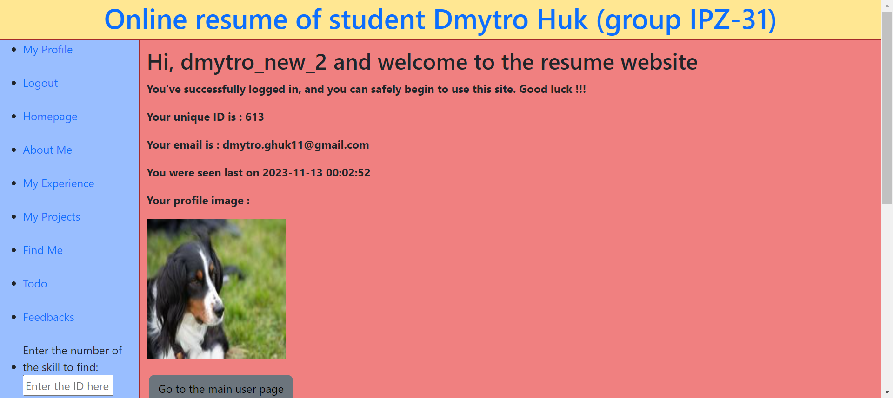

### Screenshot 2: Form for editing user data

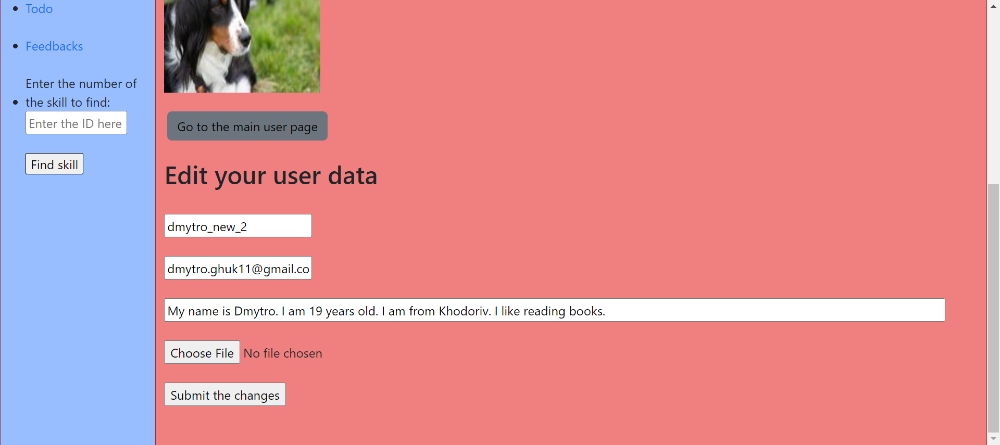

### Screenshot 3: Changing user data

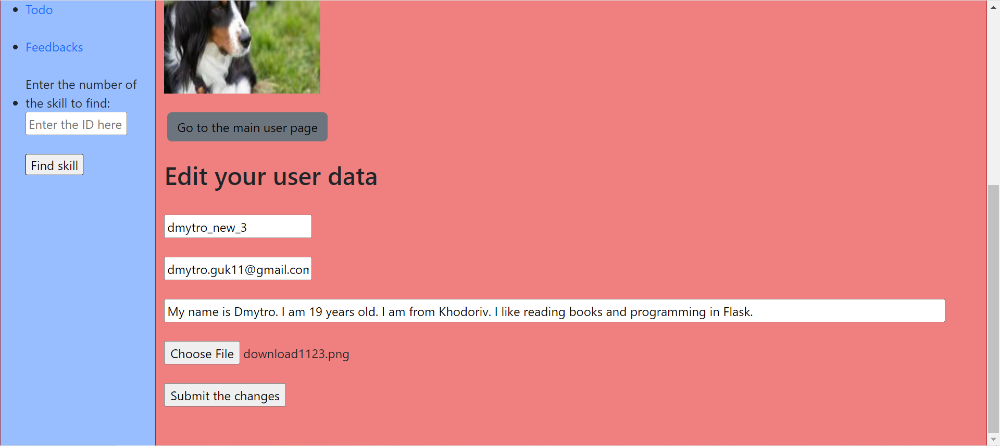

### Screenshot 4: Error changing user data

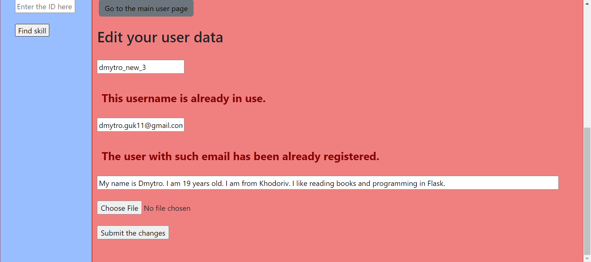

### Screenshot 5: Changing user data success

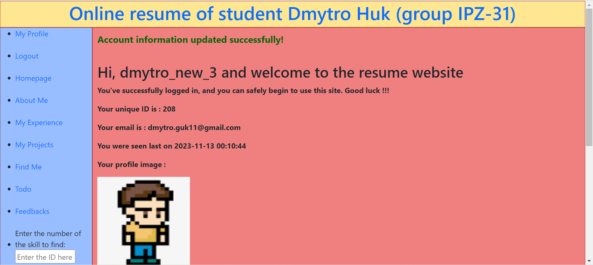

### Screenshot 6: Changes in database after executing changes user data

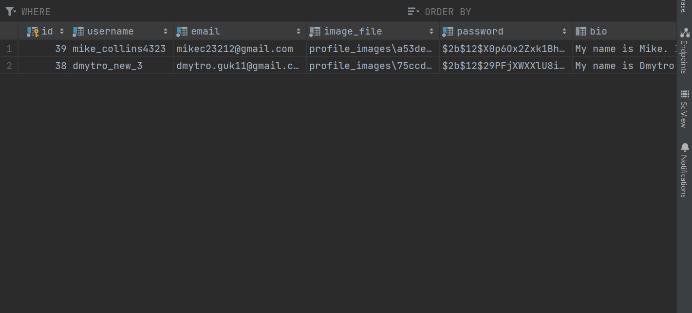

### Screenshot 7: Changing password form

### Screenshot 8: Performing password change

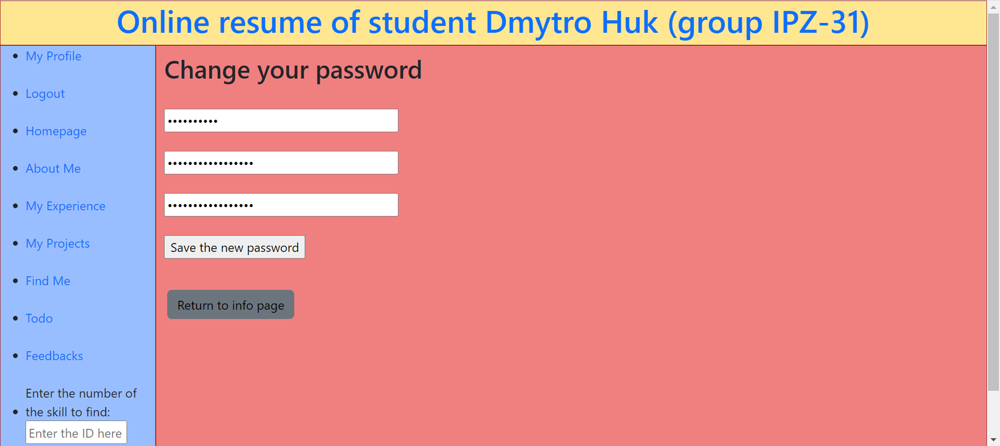

### Screenshot 9: Password change success

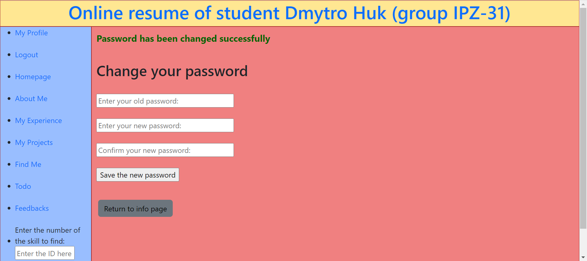

### Screenshot 10: Password change error #1

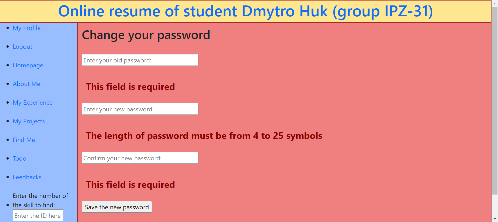

### Screenshot 11: Password change error #2

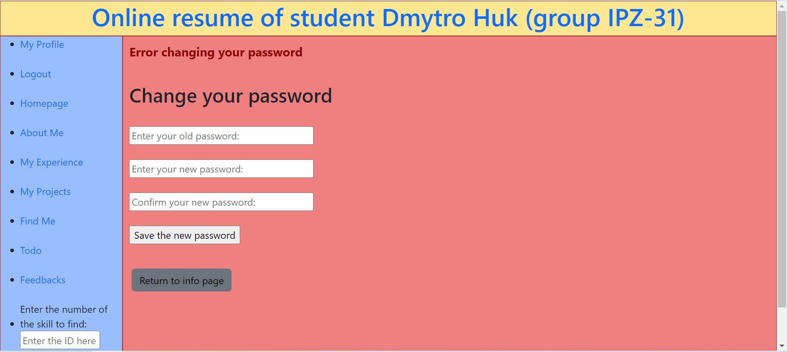

### Screenshot 12: Database changes after changing password

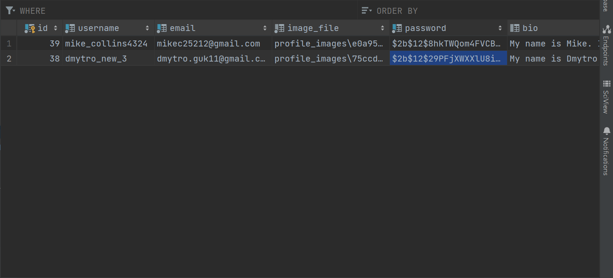

