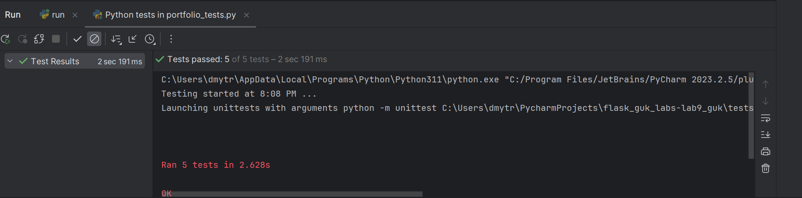
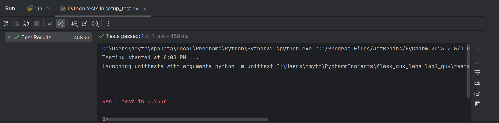
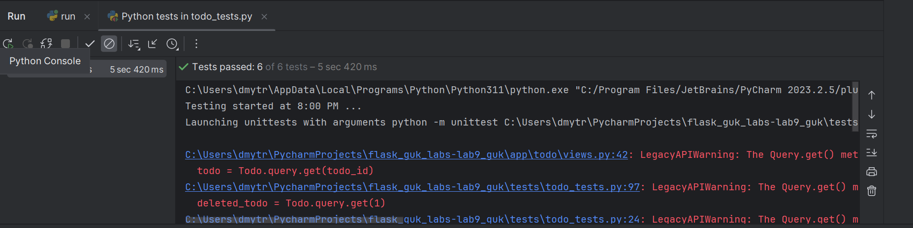
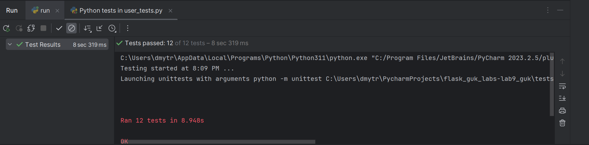

# Project Name

## Description

Lab 12 (Testing in Flask using unittest and flask-testing)

## Screenshots

Here are screenshots with demonstrated work:

### Screenshot 1: Portfolio Tests Execution

### Screenshot 2: Setup Test Execution

### Screenshot 3: Todo Tests Execution

### Screenshot 4: Users Login, Signup, and Account Change Tests Execution

