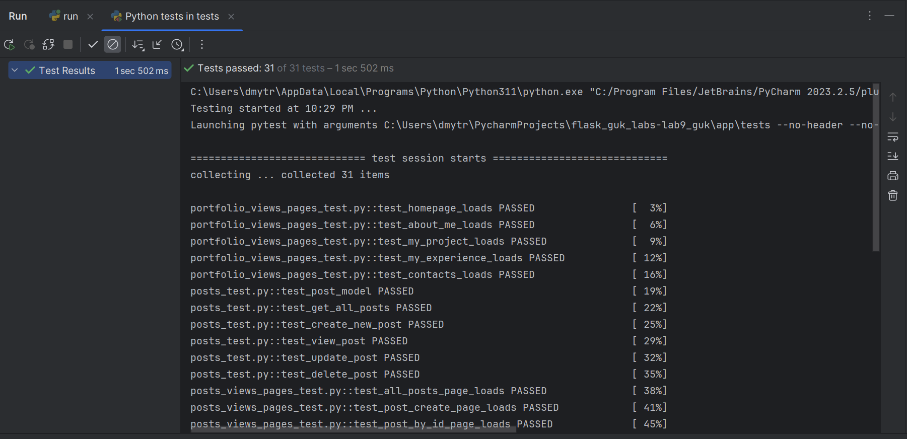
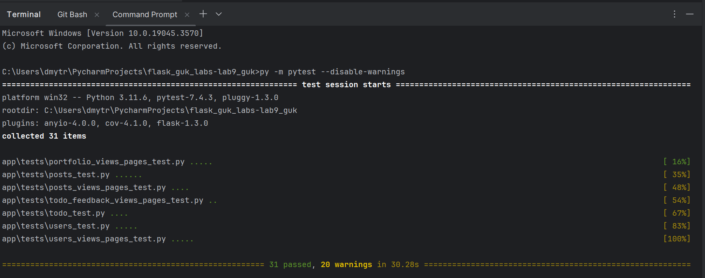
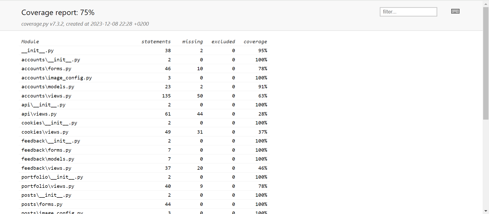

# Project Name

## Description

Lab 12. Part 2 (Using pytest for testing in Flask applications)

## Screenshots

Here are screenshots demonstrating various functionalities:

### Screenshot 1: Running all the created tests for this application (in PyCharm)

### Screenshot 2: Running all the created tests for this application (in command prompt)

### Screenshot 3: Coverage report for these tests

