# Project Name

## Description

Lab 14 (Using JWT (JSON Web Tokens) in Flask applications)

## Screenshots

Here are screenshots demonstrating various functionalities:

### Screenshot 1: Creating a Todo with JWT Authentication

### Screenshot 2: Database Changes after Creating a Todo with JWT Authentication

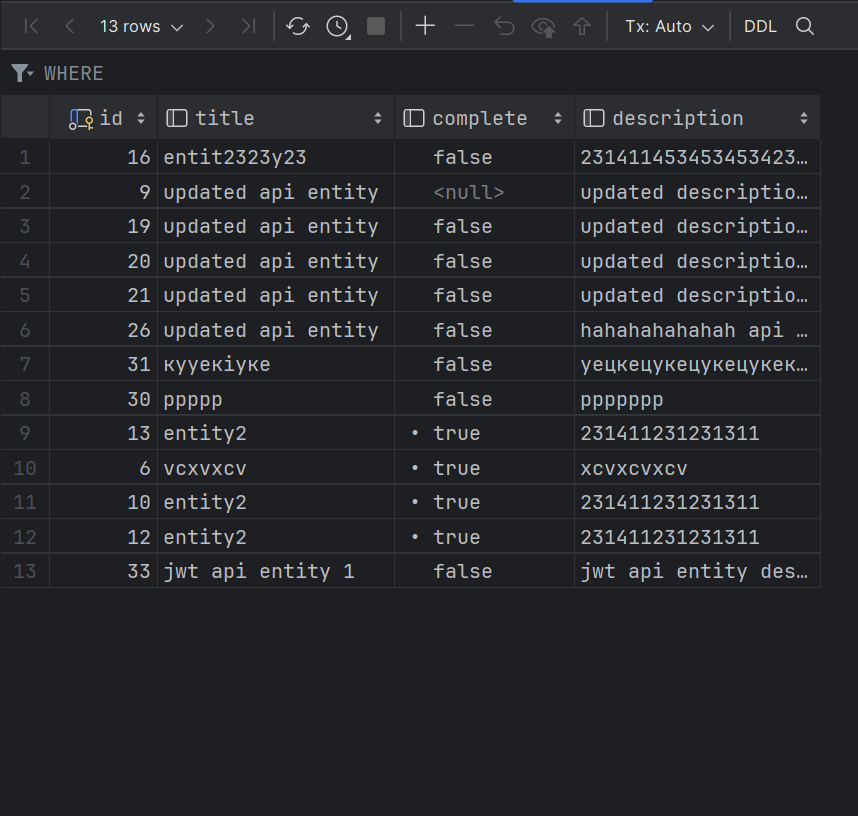

### Screenshot 3: Deleting a Todo with JWT Authentication

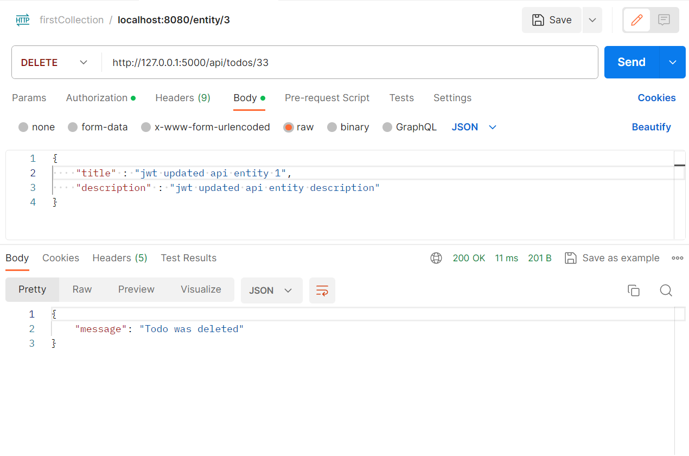

### Screenshot 4: Error for Expired Token with JWT Authentication

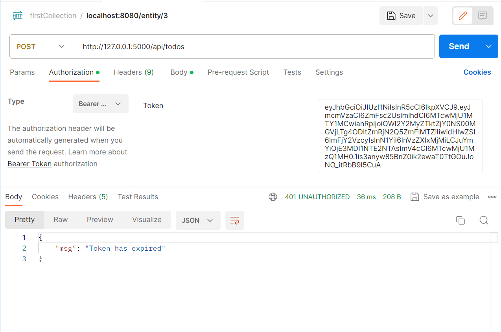

### Screenshot 5: Getting a Single Todo with JWT Authentication

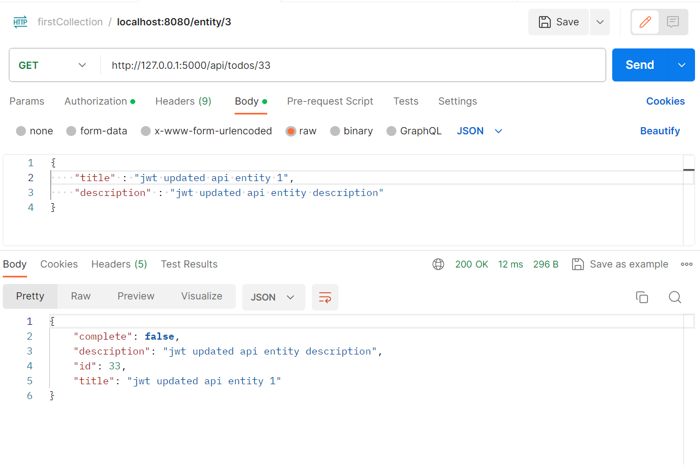

### Screenshot 6: Getting All Todos with JWT Authentication

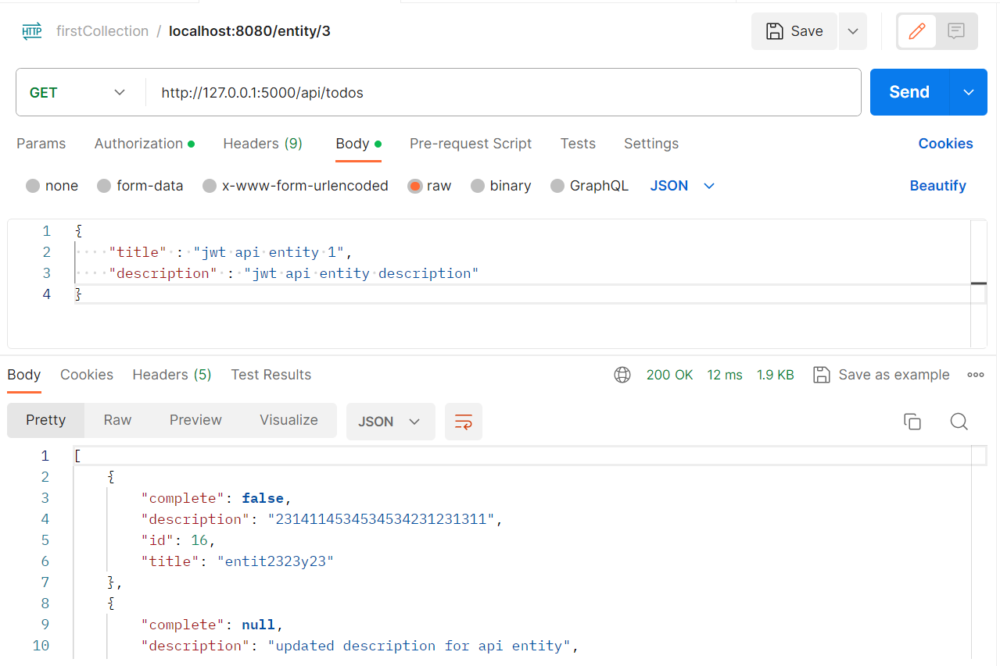

### Screenshot 7: Logging In with JWT Authentication

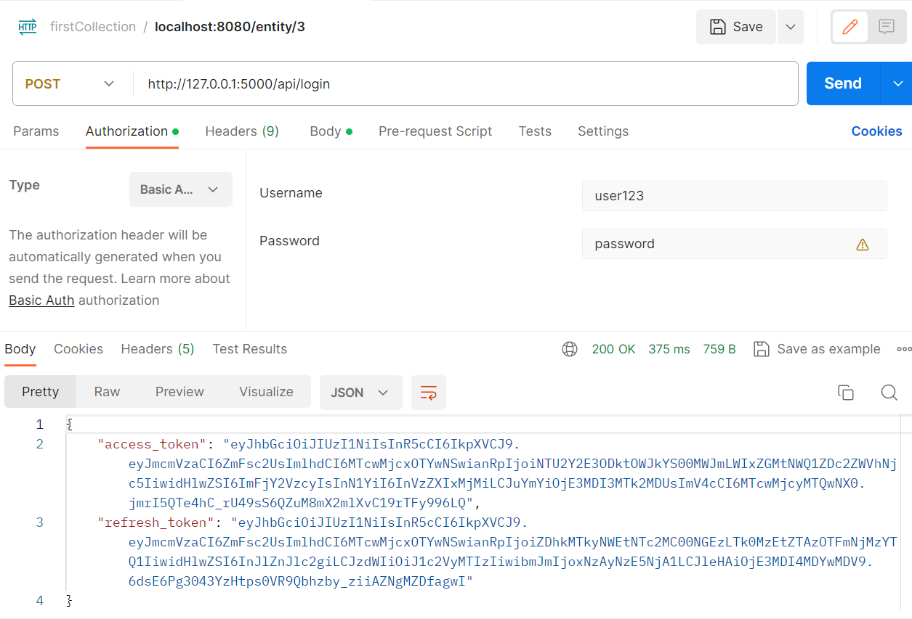

### Screenshot 8: Refreshing a Token with JWT Authentication

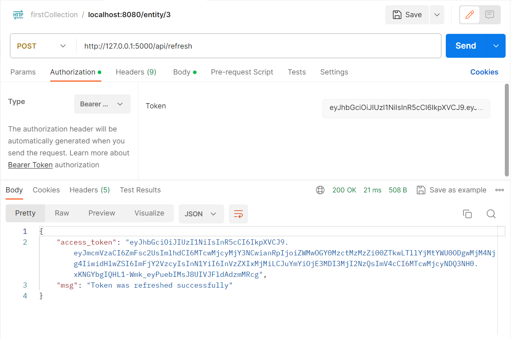

### Screenshot 9: Revoking a Token with JWT Authentication

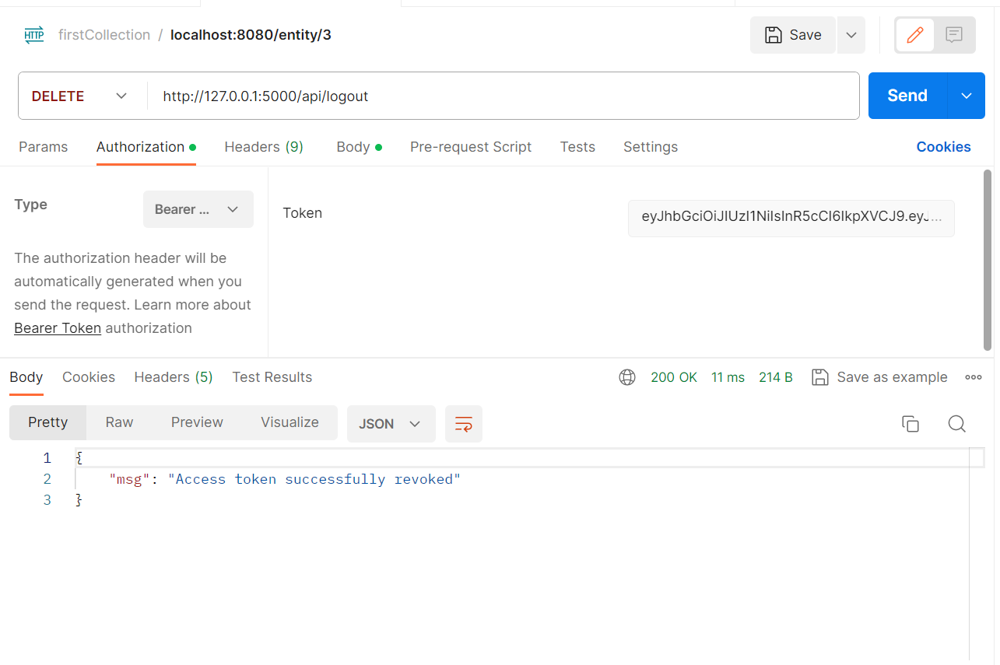

### Screenshot 10: Updating a Todo with JWT Authentication

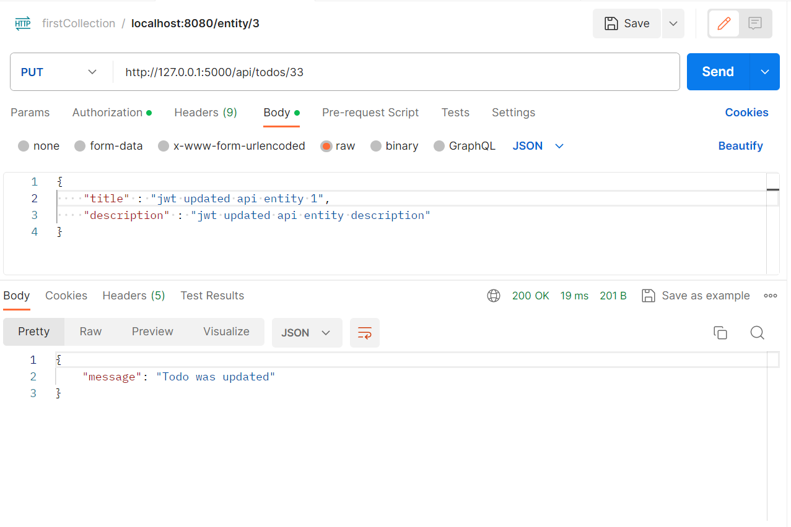

### Screenshot 11: Error for Wrong Login Data with JWT Authentication

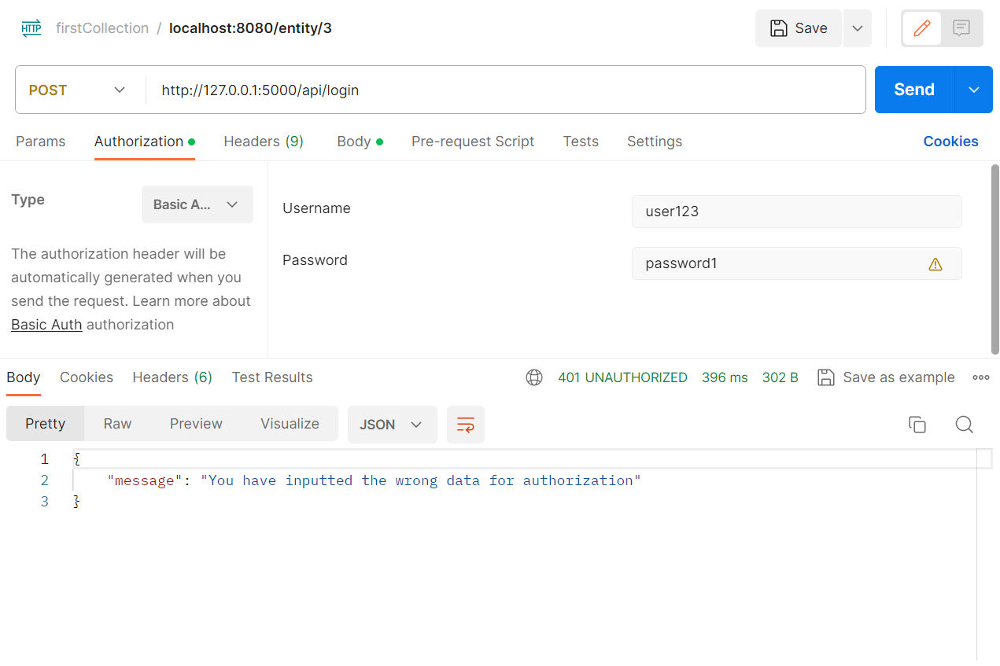

### Screenshot 12: Error for Wrong Token with JWT Authentication

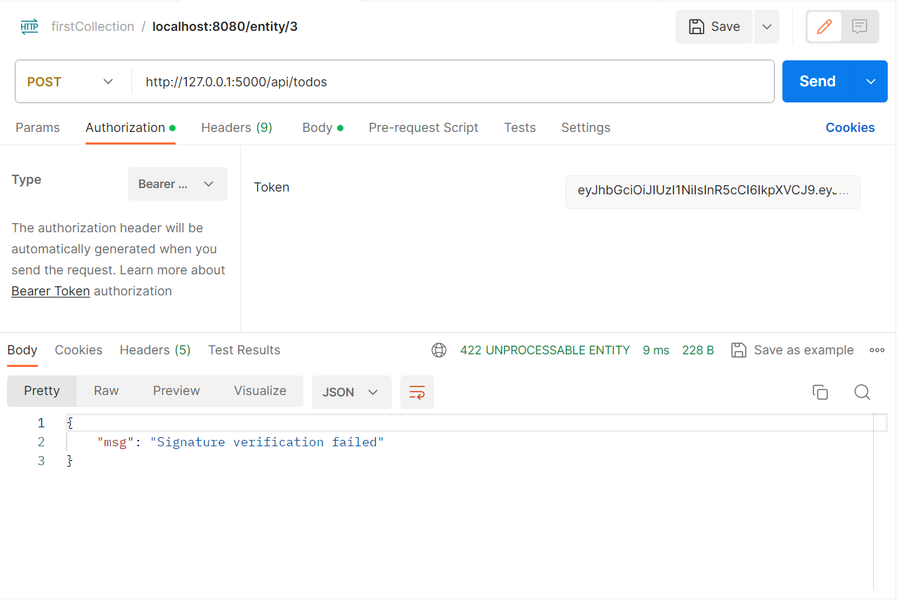
