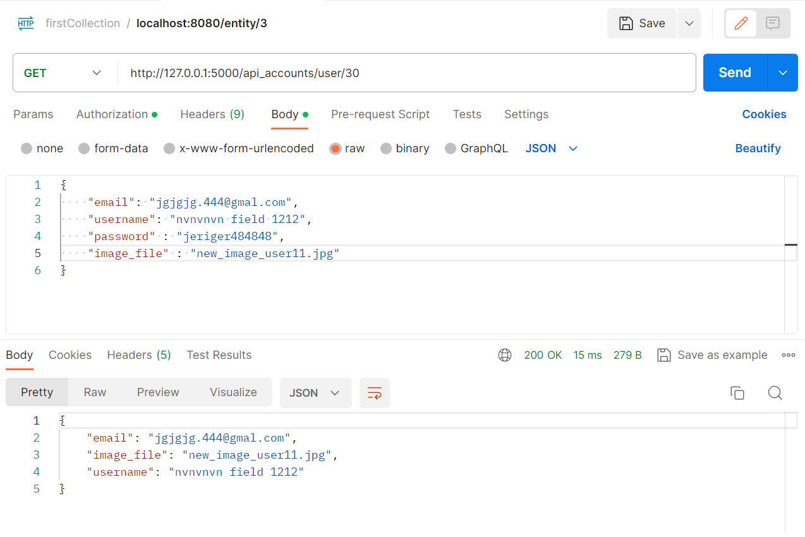

# Project Name

## Description

Lab 15 (Flask RESTful API. Marshmallow. Swagger)

## Screenshots

Here are screenshots demonstrating various functionalities:

### Screenshot 1: Creating a User with Flask RESTful API

### Screenshot 2: Getting a User with Flask RESTful API

### Screenshot 3: Getting All Users with Flask RESTful API

### Screenshot 4: Updating a User with Flask RESTful API

### Screenshot 5: Updated User Details with Flask RESTful API

### Screenshot 6: Deleting a User with Flask RESTful API

### Screenshot 7: Swagger Documentation for Flask RESTful API

### Screenshot 8: Additional Swagger Documentation for Flask RESTful API

### Screenshot 9: Sample Showcase of Method in Swagger Documentation for Flask RESTful API

